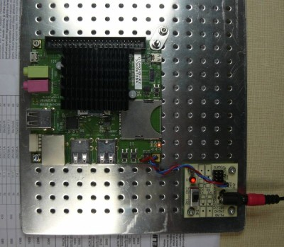

# ODroid-X2 - ARM based single board computer module

Computer module for control applications. 1.7GHz Quad-core ARM Cortex-A9 MPCore, 2GB Memory, Linux operating system.
The repository contains the MLAB base board breakout frame and some utilities. 

 

​
​
            
